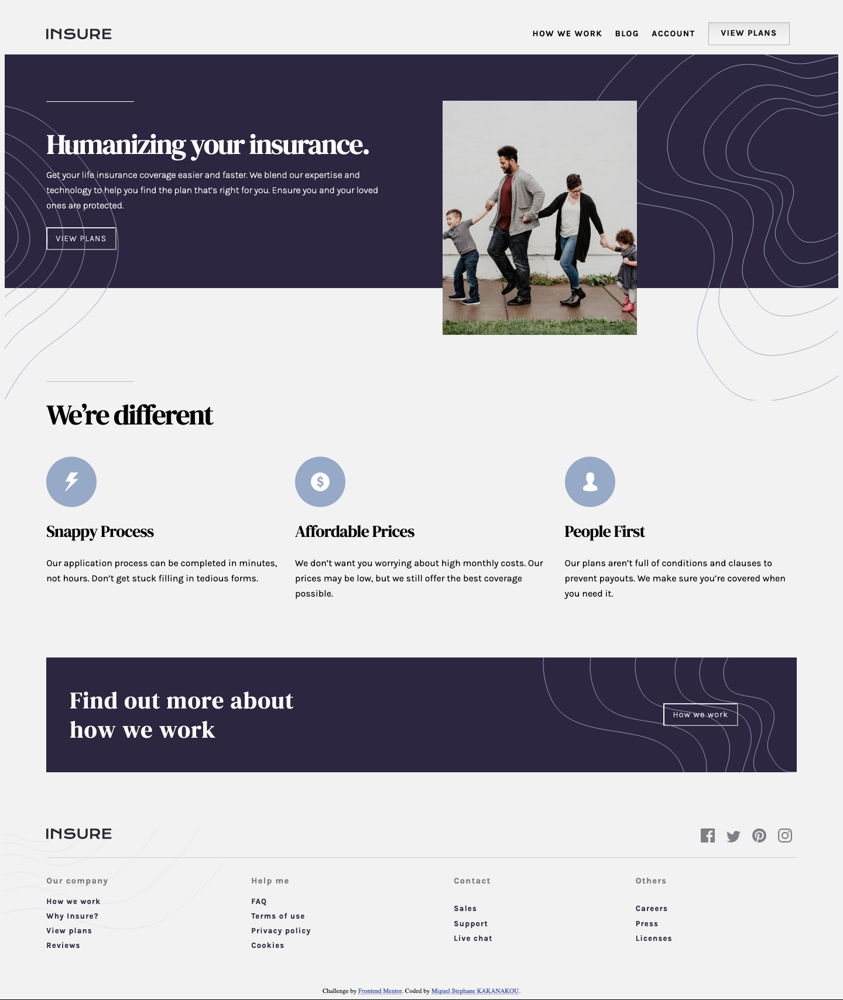
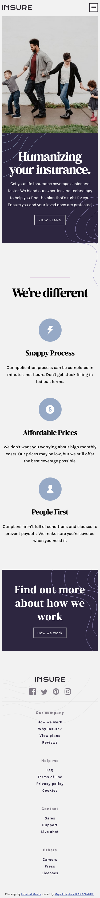

# Frontend Mentor - Insure landing page solution

This is a solution to the [Insure landing page challenge on Frontend Mentor](https://www.frontendmentor.io/challenges/insure-landing-page-uTU68JV8). 

Solution live site url: 

## Table of contents

- [Overview](#overview)
  - [The challenge](#the-challenge) 
  - [Screenshot](#screenshot)
- [My process](#my-process)
  - [Built with](#built-with)
- [Author](#author)

## Overview

### The challenge

Users should be able to:

- View the optimal layout for the site depending on their device's screen size
- See hover states for all interactive elements on the page

### Screenshot

* On Desktop

* On Mobile

### Links

- Solution URL: [Insure Landing Page Repo](https://github.com/MiguelSteph/insure-landing-page)
- Live Site URL: [Add live site URL here](https://your-live-site-url.com)

## My process

### Built with

- Semantic HTML5 markup
- CSS custom properties
- CSS Grid
- Mobile-first workflow
- JavaScript

## Author

- Linkedin - [Miguel Stephane KAKANAKOU](https://www.linkedin.com/in/kakanakou-miguel/)
